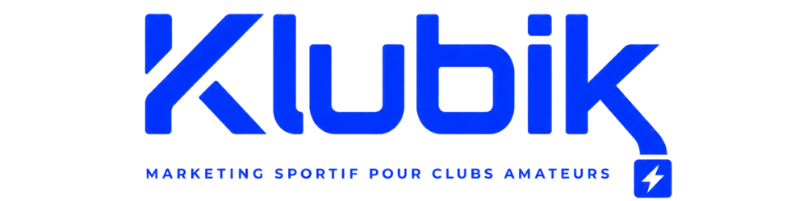

# Plan d'action SEO — Klubik
**Mis à jour le :** 9 juin 2026  
**Score actuel :** 74/100  
**Objectif :** 85/100

---

## ✅ Terminé

- [x] Meta description ajoutée sur `index.html`
- [x] `robots.txt` créé
- [x] `sitemap.xml` créé
- [x] Canonical tags ajoutés sur les 4 pages
- [x] Balises Open Graph + Twitter Card ajoutées
- [x] `<main>` encapsulant le contenu de `index.html`
- [x] Labels du formulaire liés aux champs (`for`/`id`)
- [x] `width`/`height` sur les logos + `loading="lazy"` sur le footer
- [x] Vidéo renommée `hero-kubo.mp4` (espace supprimé)
- [x] Schema.org `Organization` + `LocalBusiness` + 5 `Offer`
- [x] Bouton burger : `aria-expanded` + `aria-label` dynamiques

---

## Medium — À traiter avant le lancement

### 1. Créer l'image Open Graph
**Action :** Créer `assets/images/og-image.jpg` en 1200×630px sur Canva  
**Pourquoi :** Les balises og:image sont déjà dans le code, mais pointent vers un fichier qui n'existe pas encore. Sans ce fichier, tous les partages WhatsApp, Facebook et LinkedIn afficheront un aperçu sans image.  
**Contenu suggéré :** Logo Klubik centré, fond blanc ou bleu `#1353F4`, tagline en bas.

---

### 2. Créer un favicon
**Pourquoi :** Affiché dans l'onglet du navigateur et dans les favoris. Signal de crédibilité.  
**Outil :** [favicon.io](https://favicon.io) — uploader le logo PNG et télécharger le pack généré.  
**Code à ajouter dans le `<head>` des 4 pages :**

```html
<link rel="icon" type="image/x-icon" href="/favicon.ico" />
<link rel="icon" type="image/png" sizes="32x32" href="/favicon-32x32.png" />
<link rel="apple-touch-icon" sizes="180x180" href="/apple-touch-icon.png" />
```

---

### 3. Ajouter un poster à la vidéo hero
**Fichier :** `index.html`  
**Pourquoi :** Sans poster, la zone vidéo est noire pendant le chargement → mauvaise expérience mobile + risque de CLS.  
**Action :** Faire une capture de la première frame de la vidéo, l'enregistrer en `assets/images/hero-poster.jpg`.

```html
<video
  class="hero-video"
  src="assets/images/hero-kubo.mp4"
  poster="assets/images/hero-poster.jpg"
  autoplay muted loop playsinline
  aria-hidden="true"
  width="1920" height="1080"
></video>
```

---

### 4. Compléter les mentions légales
**Fichier :** `mentions-legales.html`  
**Remplir :**
- `[Forme juridique]` → ex. Auto-entrepreneur, SASU…
- `[Adresse complète]` → adresse postale
- `[SIRET : XXXXXXXXXX]` → numéro SIRET
- `[Prénom Nom]` → directeur de publication

---

### ~~5. Ajouter `rel="nofollow"` sur les liens Stripe~~ ✅ Terminé
**Fichier :** `index.html` — section `#packs`  
**Pourquoi :** Évite de transmettre du PageRank vers des pages de paiement tierces.

```html
<!-- Remplacer rel="noopener" par rel="noopener nofollow" sur chaque lien Stripe -->
<a href="https://buy.stripe.com/..." target="_blank" rel="noopener nofollow">
```
5 liens à mettre à jour (un par pack).

---

## Low — Backlog

### 6. Convertir le logo en WebP
```html
<picture>
  <source srcset="assets/images/logo.webp" type="image/webp" />
  
</picture>
```

### 7. Ajouter témoignages clients
Dès les premières réalisations, ajouter une section avec schema `Review` et `AggregateRating`. C'est le levier E-E-A-T le plus impactant pour une agence de services.

### 8. Ajouter les liens réseaux sociaux dans le footer
```html
<a href="https://instagram.com/klubik.fr" target="_blank" rel="noopener" aria-label="Klubik sur Instagram">
  <!-- icône Instagram SVG -->
</a>
```

### 9. Créer un llms.txt
Un fichier `llms.txt` à la racine indique aux crawlers IA (ChatGPT, Claude, Perplexity) le contenu important du site — utile pour apparaître dans les réponses IA quand quelqu'un cherche "agence marketing club amateur".

### 10. Précharger la police Inter
```html
<link rel="preload" as="style" href="https://fonts.googleapis.com/css2?family=Inter:wght@300;400;500;600;700;800;900&display=swap" />
```

---

## Impact estimé après correction des points Medium

| Catégorie | Maintenant | Après | Gain |
|---|---|---|---|
| SEO Technique | 85 | 95 | +10 |
| On-Page SEO | 88 | 93 | +5 |
| Performance | 65 | 78 | +13 |
| Images | 65 | 80 | +15 |
| **Score global** | **74** | **~85** | **+11** |
