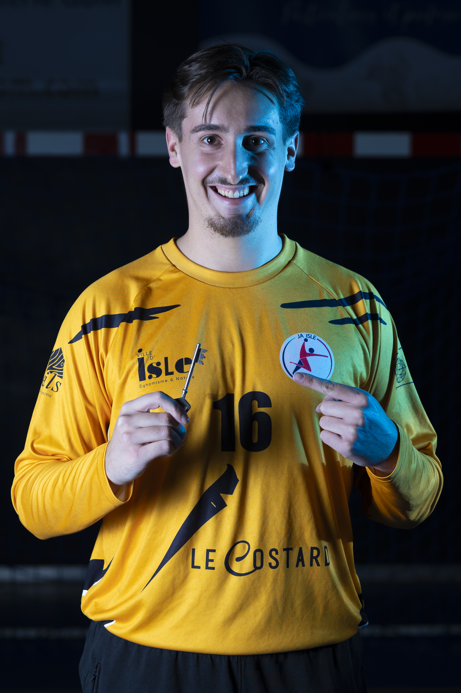

# Plan d'action — Klubik
**Mis à jour le :** 03 juillet 2026  
**Score SEO actuel :** ~59/100 (audit 5 agents, pondéré — voir note ci-dessous)  
**Objectif SEO :** 80/100

> **Note sur le score :** Les scores précédents (~72) étaient des estimations optimistes. L'audit multi-agents du 03/07 donne des mesures plus précises par catégorie. Le plus grand écart est sur E-E-A-T (estimé 60, mesuré 41) et les schémas (estimé 65, mesuré 52). Le score de 59 est une photo réaliste de l'état actuel.

---

## ✅ CRITIQUE — Tout résolu

- [x] **Lien formation** : CTA final `formation-canva.html` → `https://buy.stripe.com/dRm14maix7xr1pK8502go06`
- [x] **Favicon** : `favicon.png` à la racine + balise `<link rel="icon">` dans les 6 pages HTML
- [x] **CLS logo** : attributs HTML alignés sur le CSS — navbar `208×52`, footer `240×60` (ratio 4:1, logo 1000×250px)
- [x] **robots.txt** : `Disallow` sur dossiers et fichiers internes
- [x] **og:image** : `assets/images/og-image.png` + balises mises à jour
- [x] **Carte upsell "Pack Formation + Templates"** : supprimée (produit inexistant)
- [x] **Témoignages** : sections créées et masquées (`hidden`) sur index.html + formation-canva.html ; bouton Trustpilot visible
- [x] **`[hidden]` CSS** : `display: none !important` ajouté au reset cross-browser

---

## ✅ RAPIDE — Tout résolu

- [x] Logo navbar + footer `href="#"` → `href="/"`
- [x] `defer` sur Lucide + EmailJS + script.js (index.html + formation-canva.html)
- [x] Twitter Card complète sur formation-canva.html (title/description/image)
- [x] Instagram `target="_blank" rel="noopener noreferrer"`
- [x] robots.txt : espace encodé `/PACKS%20DESIGN%20GRAPHIC%20SPORT.pdf`
- [x] sitemap.xml : lastmod → `2026-07-03`

---

## 🟡 PRIORITÉ HAUTE — À traiter avant de scaler

### 1. Portfolio vide — frein conversion n°1
**Fichier :** `index.html` section `#portfolio`  
**Problème :** Placeholder "Les visuels arrivent bientôt". Pour une agence de design, zéro réalisation = zéro crédibilité E-E-A-T. Signal le plus attendu des visiteurs.  
**Action :** Ajouter au minimum 3 vraies réalisations (logo, maillot, template Instagram). Même des projets tests offerts à des clubs locaux suffisent.

### ~~2. Formation — badge "À venir"~~ ✅ résolu
Badge supprimé de la carte formation dans la section services. La formation a déjà sa propre section plus bas sur la page.

### 3. Témoignages — activer dès 1 avis
**Fichier :** `index.html` + `formation-canva.html`, section `#avis`  
**État actuel :** Sections `hidden`, structure prête. Bouton Trustpilot visible.  
**Action :** Dès 1 avis reçu → retirer `hidden` sur les 2 sections + remplir nom/rôle/texte/initiale.  
**Lien collecte :** `https://fr.trustpilot.com/evaluate/klubik.pro`

### 4. Formateur Tom MELLÉ — formation-canva.html
**Fichier :** `formation-canva.html` section `#formateur`  
**État actuel :** Timothé Leclercq en placeholder temporaire (photo + bio).  
**Action :** Remplacer par la photo de Tom + bio dès que disponibles.  
**Bio rédigée :** joueur N1 à Bruges 33 Handball, ex-responsable comm Saint-Médard HB et Eysines HBC.

### ~~5. Schéma Course~~ ✅ résolu
Schéma corrigé dans `formation-canva.html` : `instructor`, `image`, `url`, `educationalCredentialAwarded`, `courseMode` correct, `seller` ajouté.

### ~~6. Google Fonts — chargement non-bloquant~~ ✅ résolu
Technique `media="print" onload` appliquée sur `index.html` + `formation-canva.html`. Graisses réduites de 7 à 5 (300 et 500 supprimées — inutilisées dans le CSS).

### ~~9. Schéma WebSite~~ ✅ résolu
Schéma `WebSite` ajouté dans `index.html`.

### ~~10. FAQPage — formation-canva.html~~ ✅ résolu
Schéma `FAQPage` ajouté dans `formation-canva.html` avec les 6 vraies questions/réponses extraites du HTML.

### 6. Photo fondateur — JPEG → WebP
**Fichier :** `index.html` ligne ~500, `formation-canva.html` ligne ~1010  
**Problème :** Photo haute résolution (1771×2657) en JPEG. Gain -30 à -50% de poids avec WebP.  
**Action :** Exporter `fondateur.webp`, utiliser `<picture>` avec fallback JPEG :

```html
<picture>
  <source srcset="assets/images/fondateur.webp" type="image/webp" />
  
</picture>
```

### 7. Poster vidéo Kubo
**Fichier :** `index.html` video `.hero-video`  
**Problème :** Pas d'attribut `poster` → frame noire visible à l'arrivée sur la section.  
**Action :** Capturer la 1ère frame → `assets/images/hero-kubo-poster.webp` + ajouter `poster="assets/images/hero-kubo-poster.webp"` à la balise `<video>`.

### 9. Schéma WebSite — index.html
**Fichier :** `index.html` (avant `</body>`)  
**Problème :** Pas de schéma `WebSite`. Nécessaire pour associer le nom de marque au domaine dans Google.

```json
{
  "@context": "https://schema.org",
  "@type": "WebSite",
  "name": "Klubik",
  "url": "https://klubik.pro",
  "description": "Agence de marketing sportif pour clubs amateurs : logos, maillots, templates Canva et supports de communication.",
  "inLanguage": "fr",
  "publisher": { "@type": "Organization", "name": "Klubik" }
}
```

### 10. FAQPage — formation-canva.html
**Fichier :** `formation-canva.html` (avant `</body>`)  
**Problème :** 6 questions FAQ visibles sans schéma JSON-LD → rich result manqué.  
**Action :** Ajouter un bloc `FAQPage` avec les 6 questions de la section FAQ de la page (voir audit session 03/07).

---

## ⚪ BACKLOG

- **llms.txt** à la racine — citabilité IA (ChatGPT, Claude, Perplexity)
- **Schéma `Person`** pour Timothé Leclercq (fondateur) — signal E-E-A-T fort
- **Page 404** personnalisée
- **Auto-hébergement police Inter** (−2 connexions DNS, gain LCP)
- **Logo en WebP** avec balise `<picture>` (gain performance)
- **`og:site_name`** sur index.html + formation-canva.html (affichage LinkedIn/Facebook)
- **IndexNow** — notification instantanée Bing/Yandex (déposer clé `.txt` à la racine)
- **Orbital `document.hidden`** — pause `requestAnimationFrame` si onglet inactif
- **Icônes Lucide critiques → SVG inline** (évite dépendance JS au rendu des sections clés)
- **Email pro** `@klubik.pro` au lieu de Gmail (signal confiance visiteurs)

---

## Historique des corrections

### Session 03/07/2026
- Audit SEO complet 5 agents : Technique 71/100, E-E-A-T 41/100, Schémas 52/100, Performance 62/100, GEO 45/100
- Score global révisé à ~59/100 (pondéré) — les scores précédents étaient des estimations optimistes
- Bouton Trustpilot visible dans sections témoignages, grilles masquées via `hidden`
- `[hidden] { display: none !important }` ajouté au reset CSS
- og:image ajoutée (`og-image.png`)
- Carte upsell "Pack Formation + Templates" supprimée
- Section formateur remplie (Timothé Leclercq temporaire, photo fondateur, crédit Julie Salles)
- Section témoignages créée sur index.html + formation-canva.html (hidden, design prêt)
- Compte Trustpilot créé, meta tag vérification dans index.html
- Styles `.testi-*` ajoutés dans style.css

### Session 02/07/2026
- Lien formation Stripe corrigé
- Favicon ajouté (6 pages)
- CLS logo corrigé (208×52 / 240×60)
- robots.txt : Disallow sur dossiers et fichiers internes

### Sessions 30/06–01/07/2026
- Photo fondateur intégrée (crédit Julie Salles — ojunix.fr)
- Textes section Fondateur & Kubo mis à jour
- Fixes mobiles Kubo (H2, sous-titre, phrase cachée)
- Popup guide image pro + EmailJS
- Schéma `Course` dans formation-canva.html
- guide-image-pro.html ajouté au sitemap.xml

### Sessions 28–29/06/2026
- formation-canva.html ajouté au sitemap.xml (priorité 0.9)
- Google Analytics conditionnel au consentement RGPD
- Bandeau cookie RGPD (fond blanc, texte sportif)
- Lucide Icons épinglé à 0.475.0
- FAQ accordéon (5 Q&A + schéma FAQPage JSON-LD)
- Schéma Organization corrigé

### Avant le 28/06/2026
- Meta description, robots.txt, sitemap.xml, canonical tags
- Balises Open Graph + Twitter Card
- Schema Organization + LocalBusiness + 5 Offer
- Bouton burger accessible (aria-expanded, aria-label)
- rel="noopener nofollow" sur les liens Stripe
- Formulaire contact branché Formspree
- Mentions légales complétées

---

## Scores par catégorie (audit 03/07/2026)

| Catégorie | Poids | 28/06 | 01/07 | 03/07 (audit) | Objectif |
|---|---|---|---|---|---|
| SEO Technique | 25% | 65 | 72 | **71** | 90 |
| E-E-A-T / Contenu | 25% | 45 | 55 | **41** | 70 |
| On-Page SEO | 20% | 75 | 78 | **75** | 85 |
| Schémas | 10% | 50 | 65 | **52** | 75 |
| Performance | 10% | 60 | 62 | **62** | 78 |
| GEO / Citabilité IA | 5% | 35 | 40 | **45** | 55 |
| Images | 5% | 40 | 42 | **38** | 70 |
| **Score global (pondéré)** | | **~58** | **~65** | **~59** | **80** |
